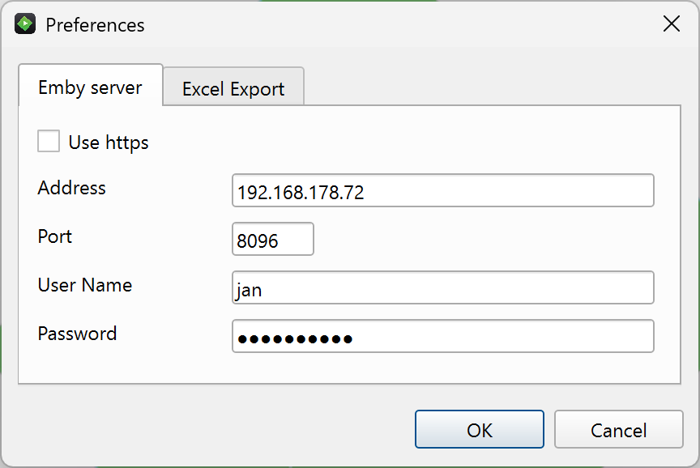
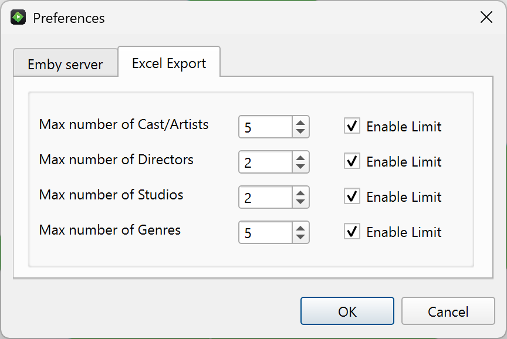
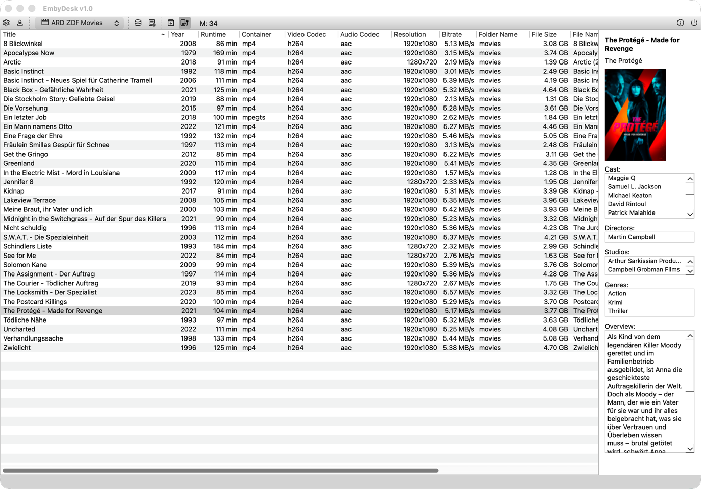
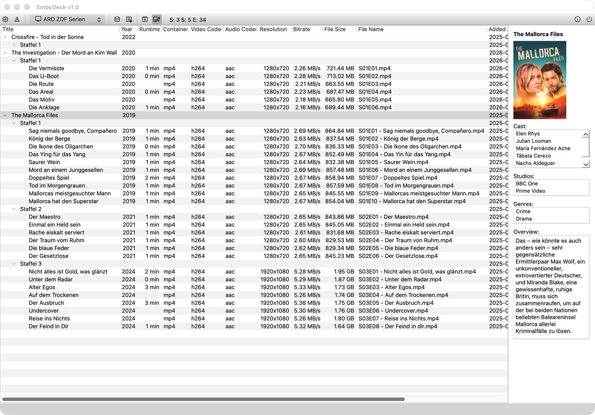
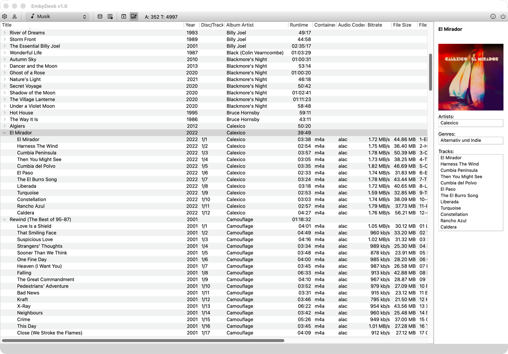
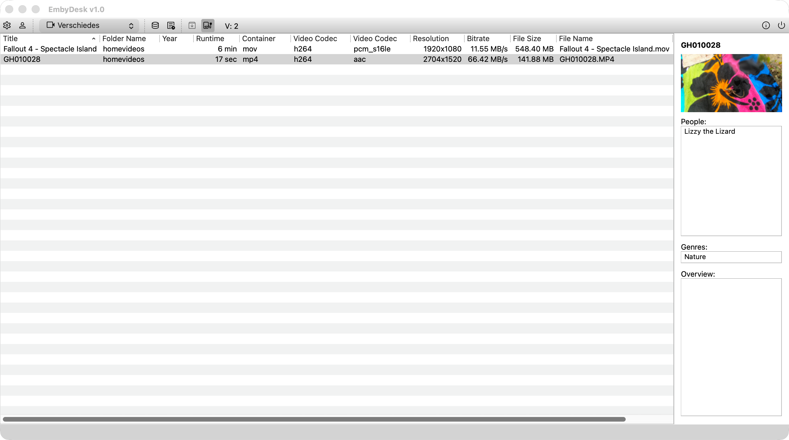
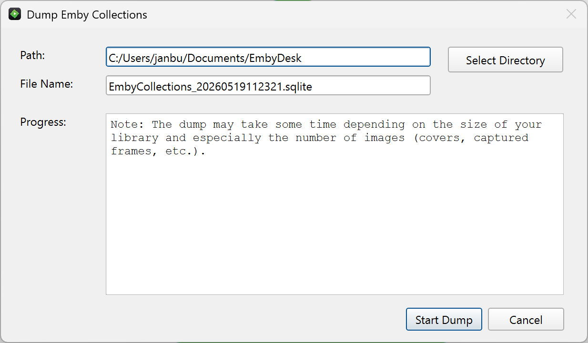

### EmbyDesk – Desktop Client for Emby (Qt6 + Go Backend)
A cross‑platform desktop application for browsing, exporting, and analyzing your Emby media library. EmbyDesk combines a Go backend (via cgo) with a Qt6.11 C++ UI, offering a fast, native, and offline‑capable experience.

### Features

🧭 **Architecture**
- Backend written in Go, using a cgo layer to expose the JBEmbyAPI shared library
→ see the corresponding JBEmbyAPI project
- Frontend written in modern C++, built with Qt 6.11, fully aligned with Qt‑RAII
- Clean separation of concerns: Go handles API + data, C++ handles UI + presentation
- EmbyDesk uses separate data models for each collection type, ensuring clean separation, strong typing, and predictable behavior across the UI and export layers.

📚 **Supported Collection Types**

EmbyDesk supports all major Emby media categories:
- Movies
- TV Shows (Series)
– Series
– Seasons
– Episodes
- Home Videos
- Music Videos
- Music
– Albums
– Tracks

🧭 **UI & Navigation**

Hierarchical Views:
- Tree view for Music (Album → Track)
- Tree view for Series (Series → Seasons → Episodes)

Detail Sheets - Dedicated detail pages for every media type:
- Movie
- Series
- Season
- Episode
- Home Video
- Music Video
- Album
- Track

Each sheet displays metadata and images.

📤 **Export Capabilities**

Excel Export
- Export any collection (movies, series, music, etc.) to Excel
- Clean, structured spreadsheets for further analysis or archiving

SQLite Export (Offline Mode)
- Export Emby metadata to a local SQLite database
- Includes:
	- Metadata fields
	- Cover images
	- Captured frame images
- Designed for fast offline browsing

🧩 **Database Model**

EmbyDesk uses a deliberately simple SQLite schema:
- No relationship tables
- Flat, predictable structure
- Optimized for:
	- Fast lookups
	- Easy debugging
	- Straightforward offline usage

🙏 **Credits & Acknowledgements**

- Emby - For providing the API structures and documentation.
- nlohmann/json - For the excellent single‑header JSON library used in the C++ layer.
- Daniel Nicoletti (dantti) and Jay Two (j2Doll) for QXlsx.
- Copilot Assistance - Copilot was especially helpful with:
	- Loading the Go shared library and registering exported functions
	- Generating JSON parser functions for the C++ data structures
	- Supporting SQLite syntax

### Screenshots

Welcome screen

Preferences

Offline mode browsing movies

Offline mode browsing series

Offline mode browsing music

Offline mode browsing home videos

Popup "Dump Emby Collections"

### Updates
**2026-05-21:**
- Added "people" for homevideos 
- Display runtime in seconds for small clips (< 1 min)

**2026-05-22:**
- Fixed "Overview" for homevideos not being displayed

**2026-5-25:**
- macOS, forgot to set unifiedTitleAndToolbar, fixed

